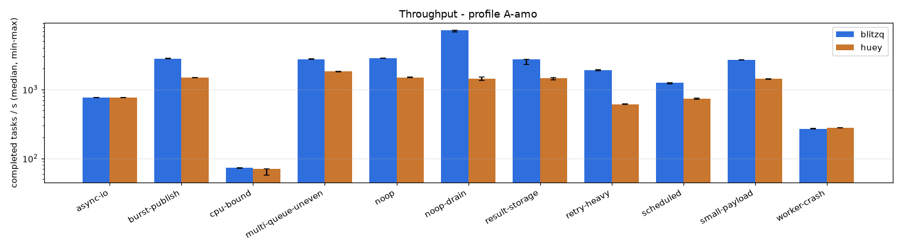
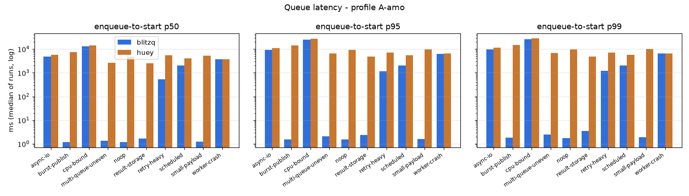
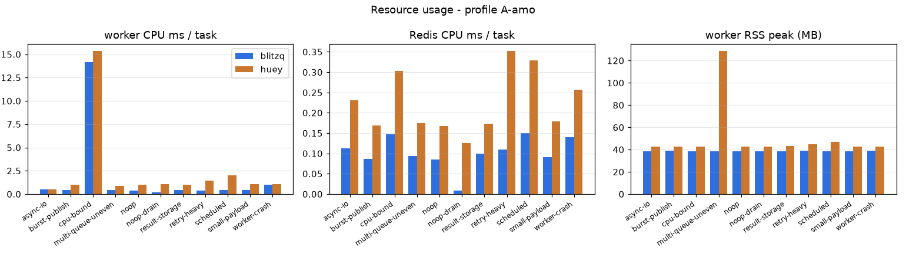
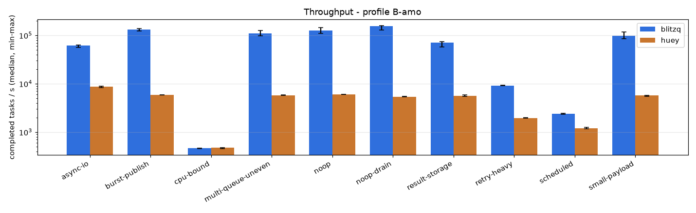
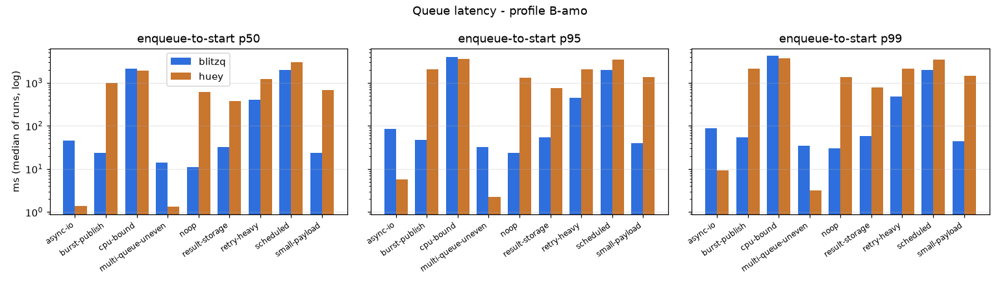
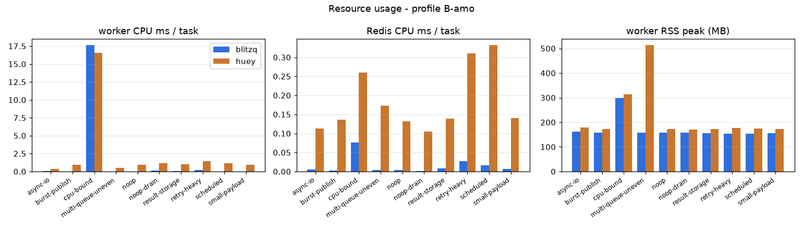
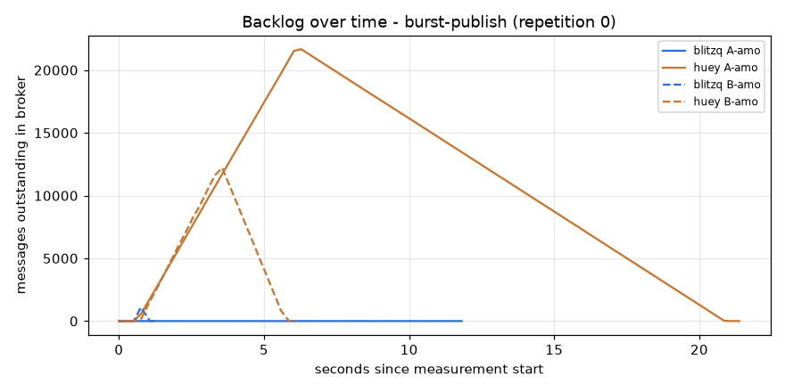
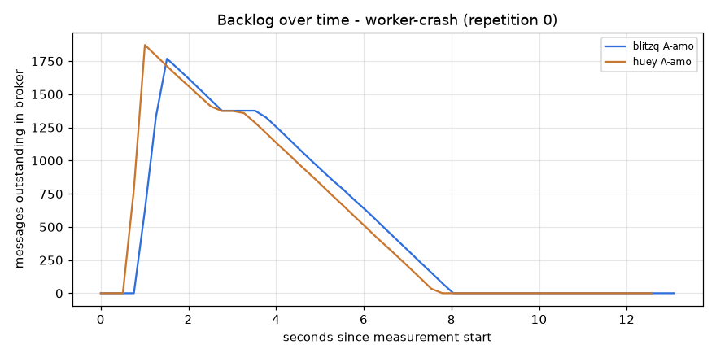
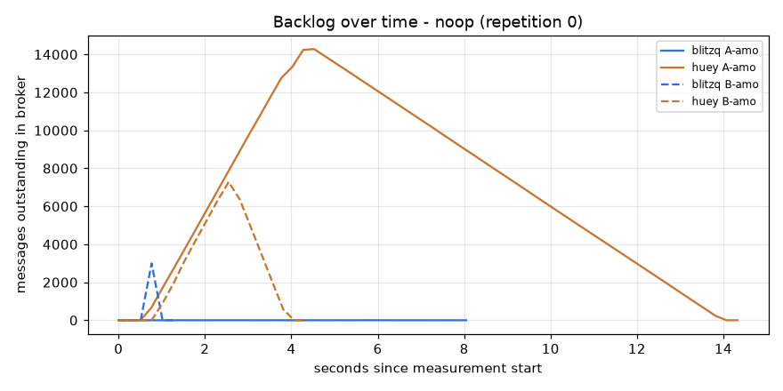
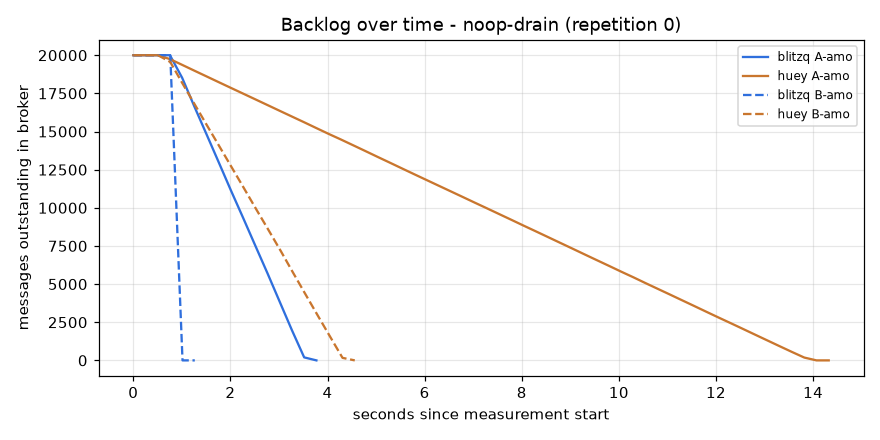

# BlitzQ vs Celery - benchmark results

Generated by `benchmarks/report.py` from raw run data; no number in this file is entered by hand.

## Environment (huey_suite-20260930T050203Z)

- Python: `3.12.14` on `Linux-6.18.33.2-microsoft-standard-WSL2-x86_64-with-glibc2.41`
- CPUs visible: 12 logical; memory 25.2 GB
- Redis: 7.4.11
- Packages: blitzq 0.1.0 (source), celery 5.6.3, kombu 5.6.2, huey 3.4.0, redis 6.4.0, msgspec 0.22.0, gevent 26.9.0, billiard 4.3.0

Command:

```
python -m benchmarks.runner --config benchmarks/configs/huey_suite.yaml
```

## Throughput speedup (BlitzQ / other system, median completed tasks per second)

| workload | profile | vs | BlitzQ tasks/s | other tasks/s | speedup | note |
|---|---|---|---:|---:|---:|---|
| async-io | A-amo | huey | 767 | 762 | 1.01x |  |
| async-io | B-amo | huey | 62120 | 8657 | 7.18x |  |
| burst-publish | A-amo | huey | 2806 | 1480 | 1.90x |  |
| burst-publish | B-amo | huey | 132245 | 5871 | 22.53x |  |
| cpu-bound | A-amo | huey | 73 | 70 | 1.04x |  |
| cpu-bound | B-amo | huey | 467 | 478 | 0.98x |  |
| multi-queue-uneven | A-amo | huey | 2751 | 1835 | 1.50x |  |
| multi-queue-uneven | B-amo | huey | 110537 | 5797 | 19.07x |  |
| noop | A-amo | huey | 2847 | 1499 | 1.90x |  |
| noop | B-amo | huey | 126462 | 6024 | 20.99x |  |
| noop-drain | A-amo | huey | 7204 | 1438 | 5.01x |  |
| noop-drain | B-amo | huey | 155695 | 5414 | 28.76x |  |
| result-storage | A-amo | huey | 2746 | 1459 | 1.88x |  |
| result-storage | B-amo | huey | 70449 | 5596 | 12.59x |  |
| retry-heavy | A-amo | huey | 1914 | 609 | 3.14x |  |
| retry-heavy | B-amo | huey | 9218 | 1956 | 4.71x |  |
| scheduled | A-amo | huey | 1245 | 742 | 1.68x | throughput bounded by the 2 s delay; compare schedule lateness |
| scheduled | B-amo | huey | 2419 | 1200 | 2.02x | throughput bounded by the 2 s delay; compare schedule lateness |
| small-payload | A-amo | huey | 2673 | 1418 | 1.89x |  |
| small-payload | B-amo | huey | 98999 | 5731 | 17.28x |  |
| worker-crash | A-amo | huey | 270 | 280 | - | not comparable: blitzq left 16 tasks incomplete, huey left 16 tasks incomplete |

## Detailed results (medians across repetitions)

| workload | profile | system | runs | tasks/s (min-max) | CV % | enqueue/s | start p50/p95/p99 ms | e2e p99 ms | not completed (max) | lost | dup | worker CPU ms/task | Redis CPU ms/task | Redis cmds/task | worker RSS MB |
|---|---|---|---:|---|---:|---:|---|---:|---:|---:|---:|---:|---:|---:|---:|
| async-io | A-amo | blitzq | 5 | 767 (766-769) | 0.1 | 2940 | 4790.6/9139.4/9527.2 | 9547.3 | 0 | 0 | 0 | 0.485 | 0.112 | 1.87 | 39 |
| async-io | A-amo | huey | 5 | 762 (761-764) | 0.2 | 5740 | 5670.8/10796.5/11251.5 | 11271.5 | 0 | 0 | 0 | 0.534 | 0.231 | 4.02 | 43 |
| async-io | B-amo | blitzq | 5 | 62120 (56527-62708) | 5.0 | 156296 | 46.4/85.7/89.2 | 109.5 | 0 | 0 | 0 | 0.047 | 0.005 | 1.04 | 162 |
| async-io | B-amo | huey | 5 | 8657 (8231-8840) | 2.6 | 8816 | 1.4/5.7/9.2 | 30.0 | 0 | 0 | 0 | 0.374 | 0.113 | 4.05 | 179 |
| burst-publish | A-amo | blitzq | 5 | 2806 (2784-2816) | 0.4 | 2806 | 1.2/1.6/1.8 | 1.8 | 0 | 0 | 0 | 0.413 | 0.087 | 1.81 | 39 |
| burst-publish | A-amo | huey | 5 | 1480 (1474-1482) | 0.2 | 5436 | 7416.5/14017.6/14604.0 | 14604.0 | 0 | 0 | 0 | 1.020 | 0.169 | 4.01 | 43 |
| burst-publish | B-amo | blitzq | 5 | 132245 (122299-137034) | 4.4 | 133418 | 24.0/46.8/53.9 | 53.9 | 0 | 0 | 0 | 0.028 | 0.003 | 1.02 | 159 |
| burst-publish | B-amo | huey | 5 | 5871 (5837-5890) | 0.3 | 10221 | 1004.0/2056.7/2157.9 | 2157.9 | 0 | 0 | 0 | 0.943 | 0.136 | 4.01 | 172 |
| cpu-bound | A-amo | blitzq | 5 | 73 (72-74) | 0.9 | 2790 | 13343.2/25439.3/26533.9 | 26567.3 | 0 | 0 | 0 | 14.135 | 0.148 | 1.52 | 39 |
| cpu-bound | A-amo | huey | 5 | 70 (57-70) | 8.7 | 5405 | 14070.7/26758.6/27915.7 | 27960.1 | 0 | 0 | 0 | 15.330 | 0.304 | 4.24 | 43 |
| cpu-bound | B-amo | blitzq | 5 | 467 (453-469) | 1.8 | 51977 | 2157.7/4026.1/4194.8 | 4209.8 | 0 | 0 | 0 | 17.620 | 0.077 | 2.03 | 298 |
| cpu-bound | B-amo | huey | 5 | 478 (460-482) | 1.8 | 5277 | 1908.4/3603.4/3753.1 | 3771.8 | 0 | 0 | 0 | 16.525 | 0.259 | 4.05 | 315 |
| multi-queue-uneven | A-amo | blitzq | 5 | 2751 (2732-2767) | 0.6 | 2752 | 1.4/2.0/2.5 | 2.5 | 0 | 0 | 0 | 0.416 | 0.094 | 2.01 | 38 |
| multi-queue-uneven | A-amo | huey | 5 | 1835 (1811-1842) | 0.6 | 5046 | 2649.1/6502.5/6843.6 | 6843.6 | 0 | 0 | 0 | 0.909 | 0.175 | 4.04 | 128 |
| multi-queue-uneven | B-amo | blitzq | 5 | 110537 (98261-126368) | 9.4 | 110276 | 14.3/32.4/35.1 | 35.1 | 0 | 0 | 0 | 0.031 | 0.005 | 1.05 | 157 |
| multi-queue-uneven | B-amo | huey | 5 | 5797 (5748-5884) | 0.9 | 5798 | 1.3/2.3/3.1 | 3.1 | 0 | 0 | 0 | 0.530 | 0.173 | 4.02 | 513 |
| noop | A-amo | blitzq | 5 | 2847 (2827-2857) | 0.5 | 2847 | 1.2/1.5/1.8 | 1.8 | 0 | 0 | 0 | 0.408 | 0.086 | 1.81 | 39 |
| noop | A-amo | huey | 5 | 1499 (1493-1504) | 0.3 | 5517 | 4864.1/9201.8/9584.2 | 9584.2 | 0 | 0 | 0 | 1.009 | 0.167 | 4.01 | 43 |
| noop | B-amo | blitzq | 5 | 126462 (110146-145475) | 12.6 | 126967 | 11.2/23.7/30.2 | 30.2 | 0 | 0 | 0 | 0.027 | 0.003 | 1.02 | 157 |
| noop | B-amo | huey | 5 | 6024 (5996-6087) | 0.6 | 10308 | 619.0/1310.0/1374.5 | 1374.5 | 0 | 0 | 0 | 0.921 | 0.133 | 4.01 | 172 |
| noop-drain | A-amo | blitzq | 5 | 7204 (6841-7267) | 2.7 | 3219 | -/-/- | - | 0 | 0 | 0 | 0.186 | 0.009 | 0.16 | 39 |
| noop-drain | A-amo | huey | 5 | 1438 (1340-1512) | 4.7 | 6318 | -/-/- | - | 0 | 0 | 0 | 1.075 | 0.126 | 3.01 | 43 |
| noop-drain | B-amo | blitzq | 5 | 155695 (129156-159986) | 8.4 | 140064 | -/-/- | - | 0 | 0 | 0 | 0.138 | 0.001 | 0.02 | 158 |
| noop-drain | B-amo | huey | 5 | 5414 (5395-5453) | 0.4 | 19659 | -/-/- | - | 0 | 0 | 0 | 1.166 | 0.105 | 3.01 | 171 |
| result-storage | A-amo | blitzq | 5 | 2746 (2285-2754) | 8.5 | 2747 | 1.7/2.3/3.5 | 3.5 | 0 | 0 | 0 | 0.413 | 0.100 | 3.52 | 39 |
| result-storage | A-amo | huey | 5 | 1459 (1383-1480) | 3.0 | 5328 | 2493.4/4734.5/4927.6 | 4927.6 | 0 | 0 | 0 | 1.033 | 0.173 | 4.01 | 43 |
| result-storage | B-amo | blitzq | 5 | 70449 (57904-74045) | 9.2 | 73721 | 32.8/54.0/58.4 | 58.4 | 0 | 0 | 0 | 0.052 | 0.007 | 2.04 | 155 |
| result-storage | B-amo | huey | 5 | 5596 (5454-5871) | 3.0 | 9958 | 374.7/751.5/786.7 | 786.7 | 0 | 0 | 0 | 0.977 | 0.139 | 4.01 | 172 |
| retry-heavy | A-amo | blitzq | 5 | 1914 (1885-1924) | 0.9 | 2702 | 526.3/1168.8/1230.8 | 1230.8 | 0 | 0 | 0 | 0.384 | 0.110 | 6.66 | 39 |
| retry-heavy | A-amo | huey | 5 | 609 (602-616) | 0.9 | 5313 | 5484.4/7192.8/7255.2 | 7255.2 | 0 | 0 | 0 | 1.444 | 0.352 | 6.53 | 45 |
| retry-heavy | B-amo | blitzq | 5 | 9218 (9146-9232) | 0.4 | 91319 | 399.2/450.7/483.4 | 483.4 | 0 | 0 | 0 | 0.196 | 0.027 | 6.36 | 154 |
| retry-heavy | B-amo | huey | 5 | 1956 (1943-1969) | 0.5 | 10732 | 1244.4/2077.2/2098.5 | 2098.5 | 0 | 0 | 0 | 1.430 | 0.310 | 6.53 | 178 |
| scheduled | A-amo | blitzq | 5 | 1245 (1209-1253) | 1.4 | 2483 | 2001.7/2002.2/2002.4 | 2002.4 | 0 | 0 | 0 | 0.462 | 0.150 | 13.72 | 39 |
| scheduled | A-amo | huey | 5 | 742 (726-748) | 1.3 | 5120 | 4102.4/5599.3/5729.5 | 5729.5 | 0 | 0 | 0 | 1.998 | 0.329 | 7.03 | 47 |
| scheduled | B-amo | blitzq | 5 | 2419 (2352-2425) | 1.6 | 70234 | 2011.7/2017.0/2017.7 | 2017.7 | 0 | 0 | 0 | 0.032 | 0.016 | 9.08 | 153 |
| scheduled | B-amo | huey | 5 | 1200 (1168-1268) | 3.4 | 8121 | 3048.3/3468.1/3497.9 | 3497.9 | 0 | 0 | 0 | 1.124 | 0.332 | 7.05 | 174 |
| small-payload | A-amo | blitzq | 5 | 2673 (2668-2685) | 0.3 | 2673 | 1.2/1.6/1.9 | 1.9 | 0 | 0 | 0 | 0.431 | 0.091 | 1.80 | 39 |
| small-payload | A-amo | huey | 5 | 1418 (1410-1420) | 0.3 | 5179 | 5155.6/9741.4/10148.0 | 10148.0 | 0 | 0 | 0 | 1.056 | 0.180 | 4.01 | 43 |
| small-payload | B-amo | blitzq | 5 | 98999 (85065-117855) | 11.8 | 103426 | 24.0/39.7/44.3 | 44.3 | 0 | 0 | 0 | 0.032 | 0.006 | 1.02 | 157 |
| small-payload | B-amo | huey | 5 | 5731 (5518-5769) | 2.3 | 9752 | 675.6/1375.1/1441.1 | 1441.1 | 0 | 0 | 0 | 0.953 | 0.140 | 4.01 | 172 |
| worker-crash | A-amo | blitzq | 5 | 270 (268-271) | 0.4 | 2951 | 3776.8/6356.0/6585.9 | 6636.2 | 16 | 79 | 0 | 1.010 | 0.139 | 1.96 | 39 |
| worker-crash | A-amo | huey | 5 | 280 (278-281) | 0.4 | 5742 | 3665.6/6393.3/6638.5 | 6688.6 | 16 | 79 | 0 | 1.050 | 0.256 | 4.15 | 43 |

## Workload-specific metrics

- **multi-queue-uneven / A-amo / blitzq**: p50_ms[bulk]=1.3ms, p50_ms[normal]=1.4ms, p50_ms[urgent]=1.3ms, p99_ms[bulk]=2.4ms, p99_ms[normal]=3.0ms, p99_ms[urgent]=2.9ms
- **multi-queue-uneven / A-amo / huey**: p50_ms[bulk]=3510.8ms, p50_ms[normal]=0.4ms, p50_ms[urgent]=0.5ms, p99_ms[bulk]=6860.0ms, p99_ms[normal]=1.4ms, p99_ms[urgent]=0.7ms
- **multi-queue-uneven / B-amo / blitzq**: p50_ms[bulk]=17.0ms, p50_ms[normal]=13.2ms, p50_ms[urgent]=12.9ms, p99_ms[bulk]=35.4ms, p99_ms[normal]=27.2ms, p99_ms[urgent]=28.1ms
- **multi-queue-uneven / B-amo / huey**: p50_ms[bulk]=1.4ms, p50_ms[normal]=1.1ms, p50_ms[urgent]=1.1ms, p99_ms[bulk]=3.2ms, p99_ms[normal]=2.2ms, p99_ms[urgent]=2.3ms
- **scheduled / A-amo / blitzq**: schedule lateness p50 1.7 ms, p99 2.4 ms
- **scheduled / A-amo / huey**: schedule lateness p50 2102.4 ms, p99 3729.5 ms
- **scheduled / B-amo / blitzq**: schedule lateness p50 11.7 ms, p99 17.7 ms
- **scheduled / B-amo / huey**: schedule lateness p50 1048.3 ms, p99 1497.9 ms
- **worker-crash / A-amo / blitzq**: recovery (disruption -> last completion) 5.3s
- **worker-crash / A-amo / huey**: recovery (disruption -> last completion) 5.1s

## Individual runs (throughput, tasks/s)

- async-io / A-amo / blitzq: [766.3, 766.6, 766.9, 769.0, 766.8]
- async-io / A-amo / huey: [761.1, 761.2, 761.5, 763.7, 763.4]
- async-io / B-amo / blitzq: [56526.8, 57394.8, 62443.5, 62119.9, 62708.2]
- async-io / B-amo / huey: [8657.3, 8697.2, 8840.0, 8230.8, 8619.7]
- burst-publish / A-amo / blitzq: [2783.9, 2802.6, 2805.5, 2807.3, 2815.9]
- burst-publish / A-amo / huey: [1480.0, 1481.5, 1480.3, 1474.4, 1477.1]
- burst-publish / B-amo / blitzq: [122299.2, 127178.2, 137033.5, 132847.5, 132244.8]
- burst-publish / B-amo / huey: [5890.2, 5870.6, 5880.4, 5837.5, 5870.4]
- cpu-bound / A-amo / blitzq: [72.1, 72.9, 72.7, 73.7, 72.0]
- cpu-bound / A-amo / huey: [69.9, 70.0, 57.0, 70.1, 70.1]
- cpu-bound / B-amo / blitzq: [453.4, 453.0, 467.3, 468.1, 468.7]
- cpu-bound / B-amo / huey: [473.8, 482.1, 478.3, 478.7, 460.1]
- multi-queue-uneven / A-amo / blitzq: [2732.0, 2767.3, 2766.7, 2741.5, 2751.5]
- multi-queue-uneven / A-amo / huey: [1811.3, 1836.1, 1842.4, 1834.8, 1831.6]
- multi-queue-uneven / B-amo / blitzq: [98261.5, 106457.5, 110537.2, 115656.5, 126367.8]
- multi-queue-uneven / B-amo / huey: [5884.4, 5830.9, 5796.9, 5772.1, 5748.1]
- noop / A-amo / blitzq: [2829.4, 2856.7, 2851.5, 2846.8, 2827.2]
- noop / A-amo / huey: [1493.1, 1503.6, 1499.5, 1496.1, 1503.6]
- noop / B-amo / blitzq: [145474.5, 110146.0, 126462.0, 140115.1, 112206.6]
- noop / B-amo / huey: [6087.3, 5995.6, 6045.1, 6014.1, 6023.9]
- noop-drain / A-amo / blitzq: [7267.5, 7247.8, 7203.8, 6840.5, 6973.9]
- noop-drain / A-amo / huey: [1497.2, 1512.3, 1339.8, 1436.1, 1438.3]
- noop-drain / B-amo / blitzq: [129155.7, 158184.1, 155695.2, 159986.2, 147717.5]
- noop-drain / B-amo / huey: [5453.5, 5429.9, 5398.0, 5414.3, 5394.8]
- result-storage / A-amo / blitzq: [2754.2, 2429.1, 2284.6, 2746.3, 2746.3]
- result-storage / A-amo / huey: [1479.9, 1476.1, 1412.7, 1382.9, 1459.1]
- result-storage / B-amo / blitzq: [70449.2, 74044.7, 70309.8, 57904.1, 72118.8]
- result-storage / B-amo / huey: [5871.4, 5810.8, 5596.0, 5594.0, 5454.2]
- retry-heavy / A-amo / blitzq: [1892.7, 1920.2, 1885.5, 1914.5, 1924.3]
- retry-heavy / A-amo / huey: [602.4, 607.7, 615.8, 609.1, 615.7]
- retry-heavy / B-amo / blitzq: [9217.6, 9146.2, 9232.2, 9211.1, 9232.2]
- retry-heavy / B-amo / huey: [1955.5, 1942.9, 1948.5, 1968.5, 1963.7]
- scheduled / A-amo / blitzq: [1208.7, 1242.2, 1247.7, 1245.5, 1253.3]
- scheduled / A-amo / huey: [747.5, 731.1, 741.5, 725.9, 745.1]
- scheduled / B-amo / blitzq: [2354.5, 2419.4, 2422.1, 2424.9, 2351.9]
- scheduled / B-amo / huey: [1240.0, 1167.6, 1187.3, 1199.9, 1268.3]
- small-payload / A-amo / blitzq: [2685.2, 2672.8, 2680.9, 2668.8, 2668.3]
- small-payload / A-amo / huey: [1417.5, 1409.6, 1419.1, 1420.2, 1417.7]
- small-payload / B-amo / blitzq: [104721.4, 85065.0, 98998.6, 97823.5, 117854.7]
- small-payload / B-amo / huey: [5518.1, 5517.9, 5730.6, 5767.6, 5769.2]
- worker-crash / A-amo / blitzq: [271.1, 269.3, 268.2, 270.6, 270.1]
- worker-crash / A-amo / huey: [279.5, 279.5, 277.6, 279.9, 280.7]

## Settings per system and profile

- async-io / A-amo / blitzq: `{"concurrency": 16, "mode": "fast", "processes": 1, "producer": "sync", "style": "sync", "system": "blitzq", "visibility_timeout": 10}`
- async-io / A-amo / huey: `{"concurrency": 16, "processes": 1, "producer": "sync", "system": "huey", "visibility_timeout": 10, "worker_type": "thread"}`
- async-io / B-amo / blitzq: `{"concurrency": 500, "mode": "fast", "processes": 4, "producer": "batch", "producers": 4, "style": "async", "system": "blitzq", "visibility_timeout": 10}`
- async-io / B-amo / huey: `{"concurrency": 100, "processes": 4, "producers": 4, "system": "huey", "visibility_timeout": 10, "worker_type": "greenlet"}`
- burst-publish / B-amo / blitzq: `{"concurrency": 200, "mode": "fast", "processes": 4, "producer": "batch", "producers": 4, "style": "async", "system": "blitzq", "visibility_timeout": 10}`
- burst-publish / B-amo / huey: `{"concurrency": 16, "processes": 4, "producers": 4, "system": "huey", "visibility_timeout": 10, "worker_type": "thread"}`
- cpu-bound / B-amo / blitzq: `{"concurrency": 16, "cpu_executor": "process", "mode": "fast", "process_pool": 8, "processes": 1, "producer": "batch", "producers": 1, "style": "sync", "system": "blitzq", "visibility_timeout": 10}`
- cpu-bound / B-amo / huey: `{"concurrency": 8, "processes": 1, "producers": 1, "system": "huey", "visibility_timeout": 10, "worker_type": "process"}`

## Charts











