# BlitzQ vs Celery - benchmark results

Generated by `benchmarks/report.py` from raw run data; no number in this file is entered by hand.

## Environment (suite-20260929T211306Z)

- Python: `3.12.14` on `Linux-6.18.33.2-microsoft-standard-WSL2-x86_64-with-glibc2.41`
- CPUs visible: 12 logical; memory 25.2 GB
- Redis: 7.4.11
- Packages: blitzq 0.1.0 (source), celery 5.6.3, kombu 5.6.2, redis 6.4.0, msgspec 0.22.0, gevent 26.9.0, billiard 4.3.0

Command:

```
python -m benchmarks.runner --config benchmarks/configs/suite.yaml
```

## Throughput speedup (BlitzQ / Celery, median completed tasks per second)

| workload | profile | BlitzQ tasks/s | Celery tasks/s | speedup | note |
|---|---|---:|---:|---:|---|
| async-io | A-alo | 755 | 720 | 1.05x |  |
| async-io | B-alo | 41807 | 2632 | 15.89x |  |
| burst-publish | A-alo | 2777 | 947 | 2.93x |  |
| burst-publish | A-amo | 2862 | 964 | 2.97x |  |
| burst-publish | B-alo | 62749 | 3335 | 18.81x |  |
| cpu-bound | A-alo | 73 | 486 | 0.15x |  |
| cpu-bound | B-alo | 472 | 445 | 1.06x |  |
| large-payload | A-alo | 2296 | 474 | 4.84x |  |
| large-payload | B-alo | 3812 | 1265 | 3.01x |  |
| multi-queue-uneven | A-alo | 2730 | 933 | 2.93x |  |
| multi-queue-uneven | B-alo | 62496 | 3277 | 19.07x |  |
| noop | A-alo | 2604 | 855 | 3.05x |  |
| noop | A-amo | 2689 | 865 | 3.11x |  |
| noop | B-alo | 63542 | 3139 | 20.24x |  |
| noop-drain | A-alo | 5503 | 967 | 5.69x |  |
| noop-drain | A-amo | 7407 | 984 | 7.52x |  |
| noop-drain | B-alo | 70696 | 3738 | 18.91x |  |
| redis-interruption | A-alo | 695 | 714 | 0.97x | compare recovery and duplicates |
| redis-interruption | A-amo | 726 | 748 | 0.97x | compare recovery and duplicates |
| result-storage | A-alo | 2784 | 1002 | 2.78x |  |
| result-storage | B-alo | 49521 | 2748 | 18.02x |  |
| retry-heavy | A-alo | 1745 | 497 | 3.51x |  |
| retry-heavy | B-alo | 8577 | 1370 | 6.26x |  |
| scheduled | A-alo | 1273 | 914 | 1.39x | throughput bounded by the 2 s delay; compare schedule lateness |
| scheduled | B-alo | 2359 | 1749 | 1.35x | throughput bounded by the 2 s delay; compare schedule lateness |
| small-payload | A-alo | 2771 | 919 | 3.02x |  |
| small-payload | B-alo | 59270 | 3129 | 18.94x |  |
| worker-crash | A-alo | 106 | 19 | 5.49x | throughput dominated by recovery time; compare recovery and lost/dup |
| worker-crash | A-amo | 273 | 19 | - | not comparable: blitzq left 16 tasks incomplete, celery left 16 tasks incomplete |

## Detailed results (medians across repetitions)

| workload | profile | system | runs | tasks/s (min-max) | CV % | enqueue/s | start p50/p95/p99 ms | e2e p99 ms | not completed (max) | lost | dup | worker CPU ms/task | Redis CPU ms/task | Redis cmds/task | worker RSS MB |
|---|---|---|---:|---|---:|---:|---|---:|---:|---:|---:|---:|---:|---:|---:|
| async-io | A-alo | blitzq | 5 | 755 (753-756) | 0.1 | 2924 | 4884.3/9313.6/9706.8 | 9726.9 | 0 | 0 | 0 | 0.650 | 0.147 | 5.51 | 39 |
| async-io | A-alo | celery | 5 | 720 (716-724) | 0.4 | 1972 | 4333.2/8353.6/8709.6 | 8729.7 | 0 | 0 | 0 | 1.320 | 0.259 | 10.02 | 815 |
| async-io | B-alo | blitzq | 5 | 41807 (40375-42387) | 1.8 | 74724 | 67.8/97.0/100.2 | 138.6 | 0 | 0 | 0 | 0.084 | 0.013 | 3.05 | 161 |
| async-io | B-alo | celery | 5 | 2632 (2555-2656) | 1.8 | 5070 | 1047.7/1792.9/1850.8 | 1870.9 | 0 | 0 | 0 | 1.660 | 0.220 | 10.01 | 3258 |
| burst-publish | A-alo | blitzq | 5 | 2777 (2769-2785) | 0.2 | 2777 | 1.7/2.3/2.6 | 2.6 | 0 | 0 | 0 | 0.406 | 0.103 | 4.46 | 39 |
| burst-publish | A-alo | celery | 5 | 947 (945-954) | 0.4 | 2024 | 8818.9/16032.5/16674.7 | 16674.7 | 0 | 0 | 0 | 1.087 | 0.223 | 10.01 | 778 |
| burst-publish | A-amo | blitzq | 5 | 2862 (2852-2874) | 0.3 | 2862 | 1.2/1.5/1.7 | 1.7 | 0 | 0 | 0 | 0.405 | 0.085 | 1.82 | 39 |
| burst-publish | A-amo | celery | 5 | 964 (951-970) | 0.9 | 2031 | 8534.1/15519.4/16136.0 | 16136.0 | 0 | 0 | 0 | 1.072 | 0.222 | 10.01 | 778 |
| burst-publish | B-alo | blitzq | 5 | 62749 (61827-65475) | 2.5 | 122710 | 160.2/258.3/264.0 | 264.0 | 0 | 0 | 0 | 0.062 | 0.012 | 3.04 | 157 |
| burst-publish | B-alo | celery | 5 | 3335 (3312-3362) | 0.6 | 5930 | 2414.8/3795.9/3906.9 | 3906.9 | 0 | 0 | 0 | 1.251 | 0.196 | 10.01 | 1703 |
| cpu-bound | A-alo | blitzq | 5 | 73 (72-74) | 0.7 | 2821 | 13360.4/25390.0/26486.3 | 26528.4 | 0 | 0 | 0 | 14.105 | 0.173 | 4.05 | 38 |
| cpu-bound | A-alo | celery | 5 | 486 (470-491) | 1.7 | 1460 | 1378.1/2610.8/2720.1 | 2746.3 | 0 | 0 | 0 | 21.650 | 0.216 | 10.04 | 815 |
| cpu-bound | B-alo | blitzq | 5 | 472 (466-479) | 1.2 | 45500 | 2124.8/3990.8/4152.2 | 4168.5 | 0 | 0 | 0 | 17.650 | 0.122 | 5.95 | 298 |
| cpu-bound | B-alo | celery | 5 | 445 (435-455) | 1.8 | 1741 | 1696.5/3176.5/3307.2 | 3322.4 | 0 | 0 | 0 | 17.700 | 0.264 | 10.04 | 435 |
| large-payload | A-alo | blitzq | 5 | 2296 (2240-2307) | 1.3 | 2299 | 2.2/3.1/3.4 | 3.4 | 0 | 0 | 0 | 0.483 | 0.198 | 4.29 | 40 |
| large-payload | A-alo | celery | 5 | 474 (472-483) | 1.0 | 886 | 1632.1/2800.5/2913.9 | 2913.9 | 0 | 0 | 0 | 2.433 | 0.525 | 10.04 | 782 |
| large-payload | B-alo | blitzq | 5 | 3812 (3650-3888) | 2.4 | 5207 | 488.1/662.8/663.6 | 663.6 | 0 | 0 | 0 | 0.230 | 0.253 | 3.08 | 288 |
| large-payload | B-alo | celery | 5 | 1265 (1225-1278) | 1.7 | 2010 | 615.6/895.4/913.9 | 913.9 | 0 | 0 | 0 | 3.430 | 0.507 | 10.04 | 1724 |
| multi-queue-uneven | A-alo | blitzq | 5 | 2730 (2726-2747) | 0.3 | 2730 | 2.2/3.2/4.2 | 4.2 | 0 | 0 | 0 | 0.409 | 0.107 | 4.46 | 39 |
| multi-queue-uneven | A-alo | celery | 5 | 933 (928-938) | 0.5 | 2021 | 7218.8/11050.1/11392.7 | 11392.7 | 0 | 0 | 0 | 1.104 | 0.223 | 10.02 | 778 |
| multi-queue-uneven | B-alo | blitzq | 5 | 62496 (61449-63110) | 1.3 | 99718 | 97.2/146.3/149.1 | 149.1 | 0 | 0 | 0 | 0.062 | 0.012 | 3.06 | 156 |
| multi-queue-uneven | B-alo | celery | 5 | 3277 (3204-3314) | 1.4 | 5801 | 2091.3/2653.1/2702.2 | 2702.2 | 0 | 0 | 0 | 1.273 | 0.198 | 10.01 | 1703 |
| noop | A-alo | blitzq | 5 | 2604 (2548-2663) | 1.7 | 2605 | 1.9/2.6/3.0 | 3.0 | 0 | 0 | 0 | 0.431 | 0.109 | 4.43 | 39 |
| noop | A-alo | celery | 5 | 855 (816-881) | 3.1 | 1844 | 6457.3/12079.5/12738.9 | 12738.9 | 0 | 0 | 0 | 1.218 | 0.243 | 10.02 | 775 |
| noop | A-amo | blitzq | 5 | 2689 (2608-2726) | 1.7 | 2689 | 1.2/1.7/2.0 | 2.0 | 0 | 0 | 0 | 0.430 | 0.090 | 1.83 | 39 |
| noop | A-amo | celery | 5 | 865 (827-882) | 2.5 | 1861 | 6297.6/11796.7/12325.7 | 12325.7 | 0 | 0 | 0 | 1.213 | 0.244 | 10.02 | 779 |
| noop | B-alo | blitzq | 5 | 63542 (55149-64612) | 7.0 | 91632 | 90.2/137.2/140.0 | 140.0 | 0 | 0 | 0 | 0.062 | 0.013 | 3.04 | 156 |
| noop | B-alo | celery | 5 | 3139 (2824-3343) | 7.0 | 5262 | 1621.9/2542.6/2619.9 | 2619.9 | 0 | 0 | 0 | 1.327 | 0.205 | 10.01 | 1699 |
| noop-drain | A-alo | blitzq | 5 | 5503 (5246-5586) | 2.5 | 3146 | -/-/- | - | 0 | 0 | 0 | 0.227 | 0.021 | 2.38 | 39 |
| noop-drain | A-alo | celery | 5 | 967 (849-985) | 5.9 | 2186 | -/-/- | - | 0 | 0 | 0 | 1.131 | 0.165 | 9.02 | 780 |
| noop-drain | A-amo | blitzq | 5 | 7407 (7336-7461) | 0.7 | 3241 | -/-/- | - | 0 | 0 | 0 | 0.182 | 0.008 | 0.16 | 39 |
| noop-drain | A-amo | celery | 5 | 984 (975-995) | 0.8 | 2196 | -/-/- | - | 0 | 0 | 0 | 1.112 | 0.163 | 9.02 | 778 |
| noop-drain | B-alo | blitzq | 5 | 70696 (68713-75166) | 3.4 | 196315 | -/-/- | - | 0 | 0 | 0 | 0.157 | 0.009 | 2.04 | 157 |
| noop-drain | B-alo | celery | 5 | 3738 (3731-3766) | 0.4 | 7671 | -/-/- | - | 0 | 0 | 0 | 1.354 | 0.145 | 9.01 | 1700 |
| redis-interruption | A-alo | blitzq | 5 | 695 (666-725) | 3.4 | 2863 | 2623.6/5128.5/5359.9 | 5380.3 | 0 | 0 | 0 | 0.842 | 0.139 | 5.15 | 39 |
| redis-interruption | A-alo | celery | 5 | 714 (707-715) | 0.5 | 1946 | 2254.5/4208.7/4386.3 | 4406.5 | 0 | 0 | 77 | 1.404 | 0.263 | 10.20 | 818 |
| redis-interruption | A-amo | blitzq | 5 | 726 (704-748) | 2.3 | 2976 | 2530.4/4905.9/5134.1 | 5154.6 | 0 | 0 | 0 | 0.662 | 0.108 | 1.84 | 39 |
| redis-interruption | A-amo | celery | 5 | 748 (747-749) | 0.1 | 1955 | 2088.6/3908.4/4069.9 | 4090.0 | 0 | 0 | 2 | 1.500 | 0.266 | 10.18 | 815 |
| result-storage | A-alo | blitzq | 5 | 2784 (2758-2793) | 0.6 | 2785 | 1.9/2.5/2.8 | 2.8 | 0 | 0 | 0 | 0.402 | 0.105 | 5.32 | 39 |
| result-storage | A-alo | celery | 5 | 1002 (997-1005) | 0.4 | 1542 | 1794.2/3313.8/3448.1 | 3448.1 | 0 | 0 | 0 | 1.340 | 0.391 | 17.02 | 809 |
| result-storage | B-alo | blitzq | 5 | 49521 (47460-50738) | 2.8 | 104101 | 81.9/119.5/124.4 | 124.4 | 0 | 0 | 0 | 0.077 | 0.015 | 4.04 | 155 |
| result-storage | B-alo | celery | 5 | 2748 (2694-2756) | 0.9 | 4199 | 871.6/1293.0/1314.8 | 1314.8 | 0 | 0 | 0 | 1.718 | 0.322 | 17.01 | 1737 |
| retry-heavy | A-alo | blitzq | 5 | 1745 (1720-1761) | 0.9 | 2663 | 620.9/1394.0/1457.2 | 1457.2 | 0 | 0 | 0 | 0.432 | 0.125 | 9.77 | 39 |
| retry-heavy | A-alo | celery | 5 | 497 (495-504) | 0.7 | 1805 | 4281.6/7245.6/7250.7 | 7250.7 | 0 | 0 | 0 | 3.358 | 0.363 | 15.05 | 915 |
| retry-heavy | B-alo | blitzq | 5 | 8577 (8472-8660) | 0.8 | 62904 | 429.7/483.2/500.2 | 500.2 | 0 | 0 | 0 | 0.234 | 0.036 | 9.25 | 154 |
| retry-heavy | B-alo | celery | 5 | 1370 (1355-1393) | 1.2 | 3593 | 1520.6/2567.0/2602.7 | 2602.7 | 0 | 0 | 0 | 4.520 | 0.345 | 15.10 | 1944 |
| scheduled | A-alo | blitzq | 5 | 1273 (1264-1280) | 0.5 | 2595 | 2002.2/2002.9/2003.2 | 2003.2 | 0 | 0 | 0 | 0.432 | 0.146 | 15.51 | 39 |
| scheduled | A-alo | celery | 5 | 914 (908-914) | 0.4 | 1937 | 2002.3/2763.0/2877.5 | 2877.5 | 0 | 0 | 0 | 1.158 | 0.235 | 10.02 | 837 |
| scheduled | B-alo | blitzq | 5 | 2359 (2335-2394) | 0.9 | 40345 | 2013.3/2024.4/2026.5 | 2026.5 | 0 | 0 | 0 | 0.062 | 0.023 | 11.11 | 154 |
| scheduled | B-alo | celery | 5 | 1749 (1735-1753) | 0.5 | 5822 | 2000.6/2001.1/2001.5 | 2001.5 | 0 | 0 | 0 | 1.338 | 0.209 | 10.02 | 1743 |
| small-payload | A-alo | blitzq | 5 | 2771 (2749-2786) | 0.5 | 2772 | 1.7/2.2/2.5 | 2.5 | 0 | 0 | 0 | 0.402 | 0.102 | 4.43 | 39 |
| small-payload | A-alo | celery | 5 | 919 (916-921) | 0.2 | 1946 | 5977.2/10952.6/11399.6 | 11399.6 | 0 | 0 | 0 | 1.117 | 0.244 | 10.02 | 779 |
| small-payload | B-alo | blitzq | 5 | 59270 (58352-60308) | 1.3 | 81674 | 65.2/110.3/112.0 | 112.0 | 0 | 0 | 0 | 0.064 | 0.014 | 3.04 | 156 |
| small-payload | B-alo | celery | 5 | 3129 (3018-3170) | 1.9 | 5463 | 1710.5/2640.7/2715.5 | 2715.5 | 0 | 0 | 0 | 1.318 | 0.219 | 10.01 | 1700 |
| worker-crash | A-alo | blitzq | 5 | 106 (106-106) | 0.0 | 3030 | 3741.2/6356.6/6584.7 | 6634.8 | 0 | 0 | 1 | 1.135 | 0.202 | 5.84 | 39 |
| worker-crash | A-alo | celery | 5 | 19 (19-19) | 0.0 | 2032 | 4130.5/6667.6/103205.2 | 103255.3 | 0 | 0 | 0 | 2.605 | 0.660 | 12.88 | 821 |
| worker-crash | A-amo | blitzq | 5 | 273 (271-275) | 0.5 | 3128 | 3718.6/6280.9/6515.5 | 6565.6 | 16 | 79 | 0 | 0.925 | 0.139 | 2.03 | 39 |
| worker-crash | A-amo | celery | 5 | 19 (19-19) | 0.0 | 2022 | 4059.8/6483.2/103175.9 | 103226.0 | 16 | 80 | 0 | 2.710 | 0.680 | 12.92 | 820 |

## Workload-specific metrics

- **multi-queue-uneven / A-alo / blitzq**: p50_ms[bulk]=2.1ms, p50_ms[normal]=2.2ms, p50_ms[urgent]=2.1ms, p99_ms[bulk]=3.8ms, p99_ms[normal]=5.0ms, p99_ms[urgent]=5.0ms
- **multi-queue-uneven / A-alo / celery**: p50_ms[bulk]=8081.7ms, p50_ms[normal]=4.0ms, p50_ms[urgent]=2.4ms, p99_ms[bulk]=11410.6ms, p99_ms[normal]=18.5ms, p99_ms[urgent]=7.5ms
- **multi-queue-uneven / B-alo / blitzq**: p50_ms[bulk]=118.6ms, p50_ms[normal]=22.7ms, p50_ms[urgent]=22.1ms, p99_ms[bulk]=149.3ms, p99_ms[normal]=36.7ms, p99_ms[urgent]=37.5ms
- **multi-queue-uneven / B-alo / celery**: p50_ms[bulk]=2235.9ms, p50_ms[normal]=2.8ms, p50_ms[urgent]=2.5ms, p99_ms[bulk]=2704.0ms, p99_ms[normal]=6.0ms, p99_ms[urgent]=4.5ms
- **redis-interruption / A-alo / blitzq**: recovery (disruption -> last completion) 5.1s
- **redis-interruption / A-alo / celery**: recovery (disruption -> last completion) 4.4s
- **redis-interruption / A-amo / blitzq**: recovery (disruption -> last completion) 4.8s
- **redis-interruption / A-amo / celery**: recovery (disruption -> last completion) 4.1s
- **scheduled / A-alo / blitzq**: schedule lateness p50 2.2 ms, p99 3.2 ms
- **scheduled / A-alo / celery**: schedule lateness p50 2.3 ms, p99 877.5 ms
- **scheduled / B-alo / blitzq**: schedule lateness p50 13.3 ms, p99 26.5 ms
- **scheduled / B-alo / celery**: schedule lateness p50 0.6 ms, p99 1.5 ms
- **worker-crash / A-alo / blitzq**: recovery (disruption -> last completion) 16.9s
- **worker-crash / A-alo / celery**: recovery (disruption -> last completion) 101.6s
- **worker-crash / A-amo / blitzq**: recovery (disruption -> last completion) 5.3s
- **worker-crash / A-amo / celery**: recovery (disruption -> last completion) 101.6s

## Individual runs (throughput, tasks/s)

- async-io / A-alo / blitzq: [755.5, 755.5, 754.6, 755.1, 753.3]
- async-io / A-alo / celery: [723.8, 720.2, 716.2, 720.3, 720.7]
- async-io / B-alo / blitzq: [41806.9, 40374.5, 41852.8, 42387.4, 41646.7]
- async-io / B-alo / celery: [2554.8, 2655.6, 2558.4, 2631.7, 2637.5]
- burst-publish / A-alo / blitzq: [2785.1, 2769.1, 2784.9, 2776.2, 2776.7]
- burst-publish / A-alo / celery: [950.0, 954.1, 946.8, 946.0, 944.9]
- burst-publish / A-amo / blitzq: [2873.8, 2851.9, 2861.9, 2867.6, 2855.8]
- burst-publish / A-amo / celery: [951.5, 963.8, 966.7, 970.4, 953.5]
- burst-publish / B-alo / blitzq: [65474.6, 62426.8, 64737.9, 61827.4, 62748.9]
- burst-publish / B-alo / celery: [3361.9, 3360.9, 3312.4, 3335.5, 3330.6]
- cpu-bound / A-alo / blitzq: [72.3, 73.3, 73.5, 72.8, 72.4]
- cpu-bound / A-alo / celery: [486.4, 483.6, 469.8, 486.1, 491.4]
- cpu-bound / B-alo / blitzq: [479.4, 477.4, 469.3, 465.5, 471.8]
- cpu-bound / B-alo / celery: [444.1, 451.6, 454.9, 434.5, 444.8]
- large-payload / A-alo / blitzq: [2252.3, 2240.4, 2296.1, 2296.5, 2307.1]
- large-payload / A-alo / celery: [472.2, 474.1, 472.7, 483.0, 478.8]
- large-payload / B-alo / blitzq: [3650.2, 3759.8, 3836.0, 3812.0, 3888.2]
- large-payload / B-alo / celery: [1225.1, 1275.0, 1264.5, 1278.3, 1253.9]
- multi-queue-uneven / A-alo / blitzq: [2725.6, 2733.8, 2746.5, 2729.8, 2727.7]
- multi-queue-uneven / A-alo / celery: [932.8, 937.3, 930.8, 927.7, 937.8]
- multi-queue-uneven / B-alo / blitzq: [62890.7, 62496.3, 61471.5, 61449.2, 63109.8]
- multi-queue-uneven / B-alo / celery: [3216.2, 3276.6, 3204.3, 3277.3, 3314.1]
- noop / A-alo / blitzq: [2663.3, 2612.3, 2604.1, 2567.7, 2547.6]
- noop / A-alo / celery: [880.9, 823.4, 854.5, 857.2, 816.1]
- noop / A-amo / blitzq: [2667.2, 2726.2, 2698.6, 2608.2, 2689.1]
- noop / A-amo / celery: [848.0, 865.3, 882.5, 870.6, 826.6]
- noop / B-alo / blitzq: [55149.0, 64612.0, 64287.9, 63541.6, 58070.6]
- noop / B-alo / celery: [2823.7, 3139.5, 3313.0, 3343.4, 2993.1]
- noop-drain / A-alo / blitzq: [5246.1, 5459.0, 5586.3, 5569.3, 5502.5]
- noop-drain / A-alo / celery: [848.7, 920.9, 966.7, 968.2, 985.1]
- noop-drain / A-amo / blitzq: [7442.7, 7460.7, 7336.0, 7406.6, 7369.2]
- noop-drain / A-amo / celery: [975.2, 986.4, 977.7, 984.3, 995.1]
- noop-drain / B-alo / blitzq: [70695.6, 70293.5, 71319.1, 68713.0, 75166.3]
- noop-drain / B-alo / celery: [3765.8, 3737.6, 3730.9, 3752.6, 3734.1]
- redis-interruption / A-alo / blitzq: [694.5, 718.3, 694.5, 725.3, 665.5]
- redis-interruption / A-alo / celery: [714.6, 707.4, 708.4, 714.4, 714.8]
- redis-interruption / A-amo / blitzq: [712.7, 729.8, 747.7, 704.2, 726.0]
- redis-interruption / A-amo / celery: [748.5, 746.6, 746.7, 747.9, 748.7]
- result-storage / A-alo / blitzq: [2793.4, 2758.1, 2764.2, 2783.5, 2787.6]
- result-storage / A-alo / celery: [1004.8, 1002.5, 1005.3, 996.7, 997.8]
- result-storage / B-alo / blitzq: [48066.6, 47460.3, 50738.3, 49520.9, 50011.3]
- result-storage / B-alo / celery: [2755.6, 2748.1, 2748.5, 2693.8, 2726.4]
- retry-heavy / A-alo / blitzq: [1747.3, 1744.5, 1744.0, 1720.0, 1761.2]
- retry-heavy / A-alo / celery: [497.5, 501.3, 503.8, 495.0, 496.3]
- retry-heavy / B-alo / blitzq: [8660.3, 8588.8, 8541.4, 8577.5, 8472.4]
- retry-heavy / B-alo / celery: [1366.3, 1389.5, 1369.7, 1392.7, 1354.7]
- scheduled / A-alo / blitzq: [1273.1, 1280.0, 1264.5, 1272.8, 1267.3]
- scheduled / A-alo / celery: [907.8, 913.6, 914.3, 913.8, 907.7]
- scheduled / B-alo / blitzq: [2358.6, 2374.6, 2358.1, 2335.1, 2393.5]
- scheduled / B-alo / celery: [1735.1, 1753.0, 1748.8, 1740.1, 1752.9]
- small-payload / A-alo / blitzq: [2748.9, 2785.8, 2769.2, 2778.5, 2771.3]
- small-payload / A-alo / celery: [917.6, 919.2, 918.7, 915.7, 921.0]
- small-payload / B-alo / blitzq: [59269.8, 58351.6, 60308.1, 59808.5, 58760.7]
- small-payload / B-alo / celery: [3129.3, 3169.6, 3156.1, 3116.4, 3018.3]
- worker-crash / A-alo / blitzq: [106.0, 105.9, 106.0, 106.0, 106.0]
- worker-crash / A-alo / celery: [19.3, 19.3, 19.3, 19.3, 19.3]
- worker-crash / A-amo / blitzq: [273.5, 274.5, 274.3, 271.4, 271.8]
- worker-crash / A-amo / celery: [19.1, 19.1, 19.1, 19.1, 19.1]

## Settings per system and profile

- async-io / A-alo / blitzq: `{"concurrency": 16, "mode": "reliable", "processes": 1, "producer": "sync", "style": "sync", "system": "blitzq", "visibility_timeout": 10}`
- async-io / A-alo / celery: `{"acks_late": true, "concurrency": 16, "pool": "prefork", "prefetch": 4, "processes": 1, "producer": "sync", "system": "celery", "visibility_timeout": 10}`
- async-io / B-alo / blitzq: `{"concurrency": 500, "mode": "reliable", "processes": 4, "producer": "batch", "producers": 4, "style": "async", "system": "blitzq", "visibility_timeout": 10}`
- async-io / B-alo / celery: `{"acks_late": true, "concurrency": 16, "pool": "prefork", "prefetch": 4, "processes": 4, "producer": "sync", "producers": 4, "system": "celery", "visibility_timeout": 10}`
- burst-publish / A-amo / blitzq: `{"concurrency": 16, "mode": "fast", "processes": 1, "producer": "sync", "style": "sync", "system": "blitzq", "visibility_timeout": 10}`
- burst-publish / A-amo / celery: `{"acks_late": false, "concurrency": 16, "pool": "prefork", "prefetch": 4, "processes": 1, "producer": "sync", "system": "celery", "visibility_timeout": 10}`
- burst-publish / B-alo / blitzq: `{"concurrency": 200, "mode": "reliable", "processes": 4, "producer": "batch", "producers": 4, "style": "async", "system": "blitzq", "visibility_timeout": 10}`
- burst-publish / B-alo / celery: `{"acks_late": true, "concurrency": 8, "pool": "prefork", "prefetch": 4, "processes": 4, "producer": "sync", "producers": 4, "system": "celery", "visibility_timeout": 10}`
- cpu-bound / B-alo / blitzq: `{"concurrency": 16, "cpu_executor": "process", "mode": "reliable", "process_pool": 8, "processes": 1, "producer": "batch", "producers": 1, "style": "sync", "system": "blitzq", "visibility_timeout": 10}`
- cpu-bound / B-alo / celery: `{"acks_late": true, "concurrency": 8, "pool": "prefork", "prefetch": 4, "processes": 1, "producer": "sync", "producers": 1, "system": "celery", "visibility_timeout": 10}`

## Charts

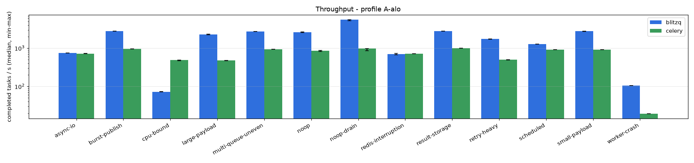
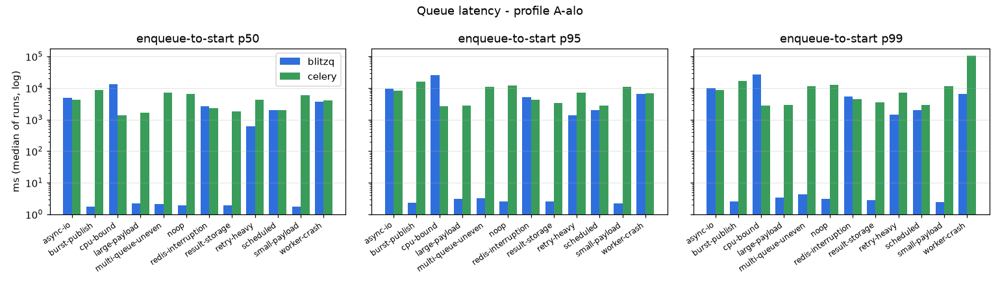
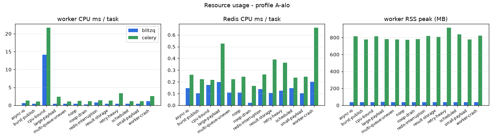
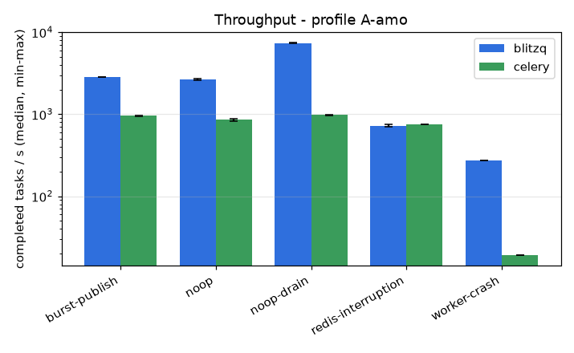
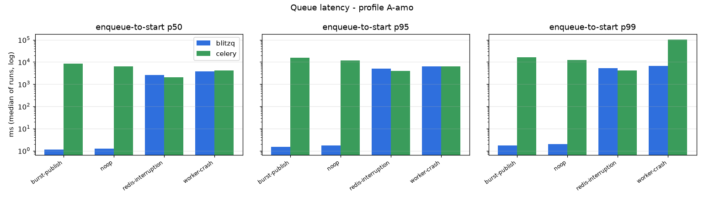
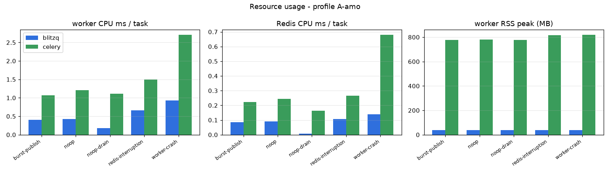
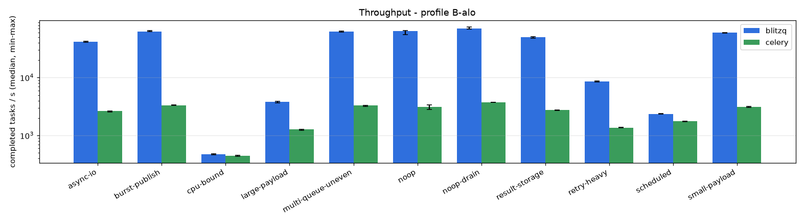
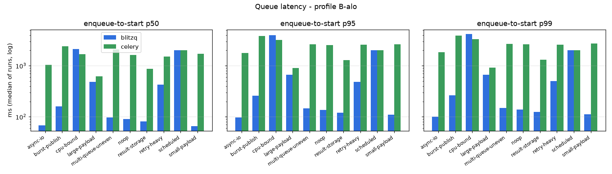
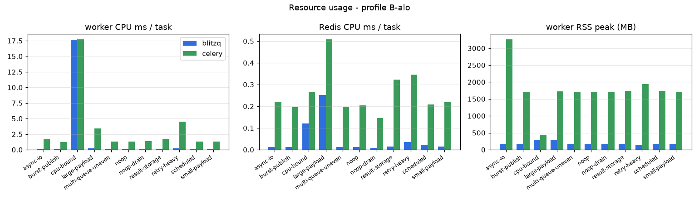
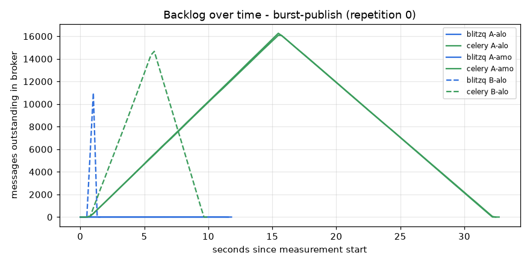
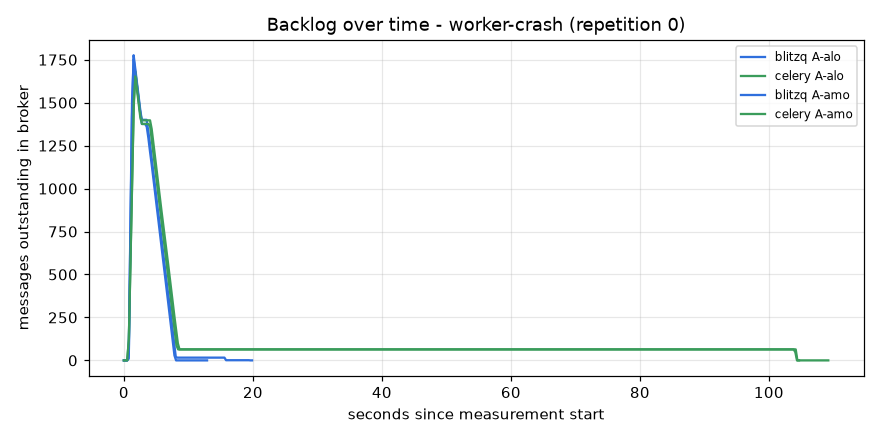
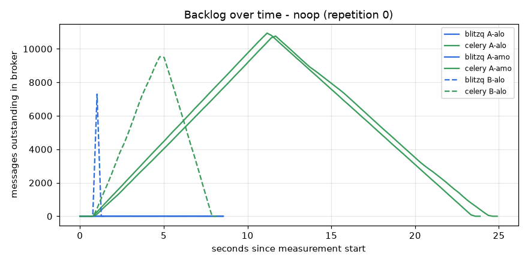
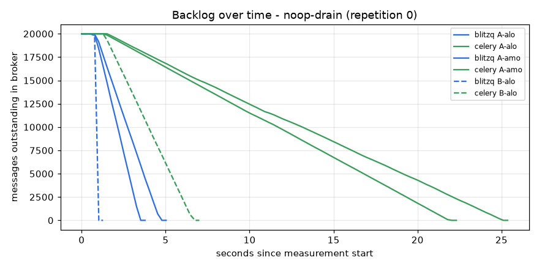
